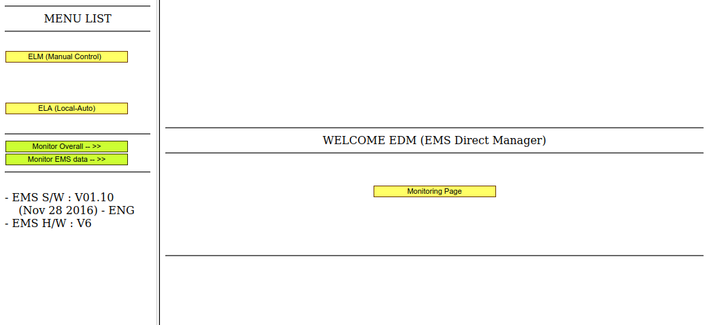
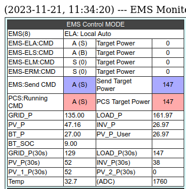

# Data Extraction for Hansol Technics AIO ESS

Tool (tools?) to help you extract useful data from a Hansol Technics
Engergy Storage System (ESS) All-In-One (AIO) solar inverter + battery.

## Before you begin

You need to know the IP Address of your ESS, and if it is using the default
port (21710) or not. There doesn't seem to be an easy way to see the IP
on the ESS itself, you'll just have to check your DHCP server / router's
"connected devices" list to find it.

Once you have the IP address, try connecting in your web browser to that
on port 21710, eg for `192.168.1.80` it'd be http://192.168.1.80:21710/ .
If that doesn't work, you may need to use something like nmap to find
what port the installer set the ESS to listen on.

## Checking your EMS software version

If you get something that looks like this:

then you should be good to go!

If you get something much fancier, then try 
[ioBroker.aio](https://github.com/Newan/ioBroker.aio/) which works with
the JSON feed that newer ESS versions apparently support.

## Data pages on the ESS

The ESS seems to have 3 pages of data, all of which have stats on
generation / load / batteries. The pages are:

 * `/F0` - overall "Monitoring data", including batteries
 * `/F0s` - additional "Monitoring data", such as CAN data
 * `/F8` - "EMS data", including weather, tarrifs and expected generation

## TODOs

 * Refactor
 * Unit test parsing
 * Nice command line arguments
 * Proper export to:
  * Console for humans
  * Console JSON
  * InfluxDB
  * Promethius

## Exporting
### InfluxDB
*need to create the DB first*
`show databases`
`create database power`

## Links

 * [Hansol's "My ESS" monitoring](https://myess.hansoltechnics.com/user/user/mon/curr/monitoring.do)
 * [ioBrokaer.aio - NodeJS library for extracting data as JSON](https://github.com/Newan/ioBroker.aio)
 * [ess-reader - Rust tool to extract data to InfluxDB](https://github.com/valkum/ess-reader)
