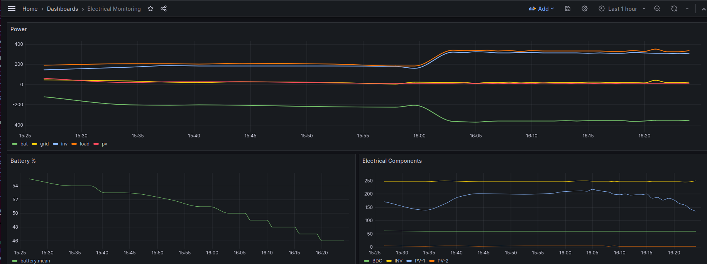

# Data Extraction for Hansol Technics AIO ESS

Tool (tools?) to help you extract useful data from a Hansol Technics
Engergy Storage System (ESS) All-In-One (AIO) solar inverter + battery.

It aims to run on Python 3 without needing many additional modules
to be installed.

## Installation

You will need Python 3. You also need the Beautiful Soup 4 python
library (eg `apt install python3-bs4` or `pip install bs4`)

Console, JSON and InfluxDB output don't require any additional 
libraries

For MQTT output, you need the Paho MQTT python library (eg
`apt install python3-paho-mqtt` or `pip install paho-mqtt).

For Prometheus output, you need the official Prometheus python
client (eg `apt install python3-prometheus-client` or 
`pip install prometheus-client`)

## Running the script

Assuming your ESS is on `192.168.1.80` (see below for help finding it
if not), to get data printed to the console run

```
python ./command.py --host 192.168.1.80 --output console
```

To export to a local InfluxDB with no authentication, you'd run
```
python ./command.py --host 192.168.1.80 --output influx
```

The InfluxDB, MQTT and Prometheus options are designed to be silent
so they can be run from `cron`.

For the full set of options, run `python ./command.py --help`

## Pretty Graphs


## Finding your ESS on the network

You need to know the IP Address of your ESS, and if it is using the default
port (21710) or not. There doesn't seem to be an easy way to see the IP
on the ESS itself, you'll just have to check your DHCP server / router's
"connected devices" list to find it.

Once you have the IP address, try connecting in your web browser to that
on port 21710, eg for `192.168.1.80` it'd be http://192.168.1.80:21710/ .
If that doesn't work, you may need to use something like nmap to find
what port the installer set the ESS to listen on.

## Checking your EMS software version

If you get something that looks like this:

then you should be good to go!

If you get something much fancier, then try 
[ioBroker.aio](https://github.com/Newan/ioBroker.aio/) which works with
the JSON feed that newer ESS versions apparently support.

## Data pages on the ESS

The ESS seems to have 3 pages of data, all of which have stats on
generation / load / batteries. The pages are:

 * `/F0` - overall "Monitoring data", including batteries
 * `/F0s` - additional "Monitoring data", such as CAN data
 * `/F8` - "EMS data", including weather, tarrifs and expected generation


## TODOs

 * Unit test parsing/extracting
 * Proper export to:
  * Prometheus

## Exporting
### MQTT
*exports everything as a single JSON message to the topic*

```
{
 "power": {
  "load": 328.66,
  "pv": 6.36,
  "inv": 307.66,
  "bat": -355.21,
  "grid": 21
 },
 "battery": {
  "charging": false,
  "charge_pct": 46,
  "charge_01": 0.46
 },
 "electrical": {
  "PV-1": {
   "component": "PV-1",
   "voltage": 158.3,
   "current": 0.0,
   "power": 6.3
  },
  "PV-2": {
   "component": "PV-2",
   "voltage": 3.3,
   "current": 0.0,
   "power": 0.0
  },
  "BDC": {
   "component": "BDC",
   "voltage": 59.7,
   "current": -5.9,
   "power": -355.2
  },
  "INV": {
   "component": "INV",
   "voltage": 245.0,
   "current": 1.7,
   "power": 304.42
  }
 }
}
```

### InfluxDB
*need to create the DB first*

`show databases`

`create database power`

### Prometheus - Push Gateway
As the script expects to run and finish, the normal Prometheus pulling
option won't work. Instead, the 
[Prometheus Push Gateway](https://github.com/prometheus/pushgateway) is
needed so that the script can send metrics then exit.

*need the push gateway installing / setting up*

*need the client installing*

## Links

 * [Hansol's "My ESS" monitoring](https://myess.hansoltechnics.com/user/user/mon/curr/monitoring.do)
 * [ioBrokaer.aio - NodeJS library for extracting data as JSON](https://github.com/Newan/ioBroker.aio)
 * [ess-reader - Rust tool to extract data to InfluxDB](https://github.com/valkum/ess-reader)
